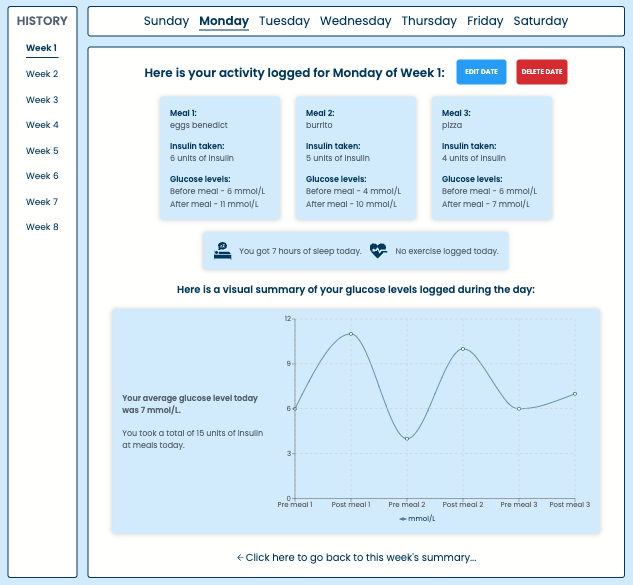

<!-- [🔗 Click here to see this project deployed live!](https://nick-abate-glucoast.netlify.app/) -->

# GLUCOAST

GLUCOAST is an all-in-one dashboard to assist diabetics in managing their glucose levels throughout the day.

[🔗 GLUCOAST - Client](https://github.com/nickabate/glucoast-client)  
[🔗 GLUCOAST - Server](https://github.com/nickabate/glucoast-server)

This is a brief regarding one of my capstone projects completed during my Software Engineering bootcamp. We were required to develop a full-stack application utilizing the various technologies we learned throughout the semester. 

We help users to track their blood sugar (glucose) levels throughout the day, by keeping a log of different variables and how they affected their blood sugar levels. GLUCOAST’s goal is to help you coast throughout the day by making informed decisions on how to manage your glucose levels without unintentionally causing glucose levels to rise or crash during your day, which is a diabetic’s biggest daily challenge.

## Built with

The front-end is built with React, is fully responsive from mobile to desktop viewports with dynamic data visualization, and the back-end runs Express on top of NodeJS supporting database CRUD operations. Sample data has been prepopulated within the datebase for one user with the ability to add, edit and delete data. Creating this project was a great utilization of the skills I learned in my bootcamp experience and showcased my skills to develop a fully functioning full-stack application. 

- [React](https://reactjs.org/) - JS library for web user interfaces
- [Express](https://expressjs.com/) - Unopinionated, minimalist web framework for Node.js
- [Sass](https://sass-lang.com/) - CSS with superpowers
- [Recharts](https://recharts.org/en-US/) - Composable charting library built on React components

## Author

Thanks for checking out my work! Feel free to reach out to me with any questions or to connect.

- Portfolio - [Live Site](https://nickabate.dev/)
- LinkedIn - [Nick Abate](https://www.linkedin.com/in/nick-abate/)
- Twitter - [@thatdevnick](https://twitter.com/thatdevnick)
